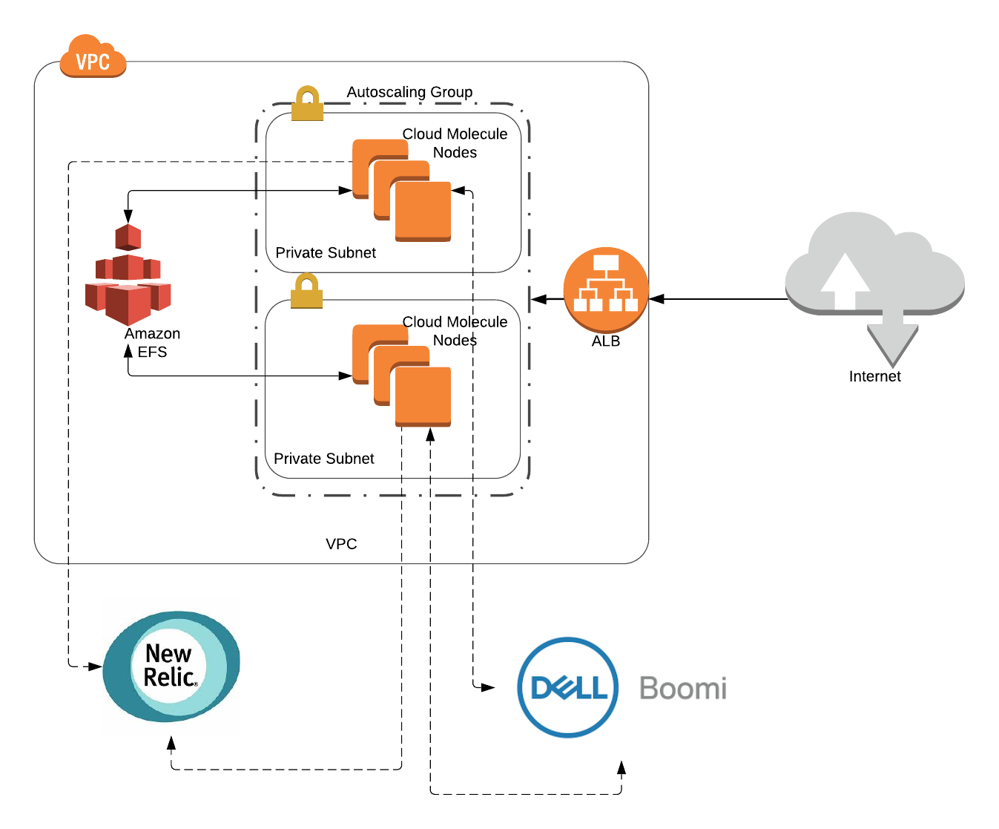

# AWS CloudFormation template for a Dell Boomi (Cloud) Molecule

### Architecture

The whole architecture is defined via four CloudFormation templates
- [boomi-full-stack.yaml](boomi-full-stack.yaml)
    - this is "root" template
- (nested) [boomi-alb.yaml](boomi-alb.yaml)
    - creates an internet-facing AWS Application Load Balancer (ALB)
- (nested) [boomi-efs.yaml](boomi-efs.yaml)
    - creates an Elastic File System (EFS) as a NFS share for the Boomi nodes
- (nested) [boomi-autoscaling.yaml](boomi-autoscaling.yaml)
    - creates an autoscaling group with Boomi nodes